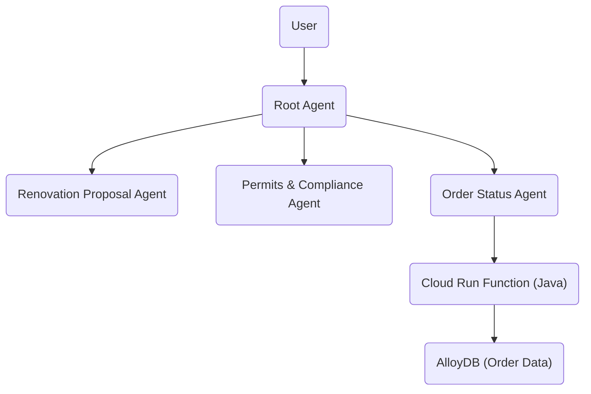

# ADK Renovation Agent

A **multiagent system for kitchen renovation** using Google Vertex AI ADK and Gemini 2.5.

---

## Table of Contents

1. [What is a Multiagent System?](#what-is-a-multiagent-system)
2. [Project Overview](#project-overview)
3. [System Architecture](#system-architecture)
4. [Agents in This Project](#agents-in-this-project)
5. [How It Works](#how-it-works)
6. [Setup Instructions](#setup-instructions)
7. [Database Setup](#database-setup)
8. [Cloud Run Function (Order Status)](#cloud-run-function-order-status)
9. [Environment Variables](#environment-variables)
10. [Running the Project](#running-the-project)
11. [Dependencies](#dependencies)
12. [Troubleshooting & FAQ](#troubleshooting--faq)
13. [License](#license)

---

## What is a Multiagent System?

A **multiagent system** is an application where multiple autonomous agents work together (and independently) to achieve a larger goal. Each agent is responsible for a specific area of expertise and can make decisions based on its own knowledge and the information it receives.

- **Agents** are autonomous programs that can:
  - Make decisions generatively
  - Act on instructions and information
  - Focus on a specific domain (e.g., proposal generation, compliance, order tracking)

**Why use a multiagent system?**
- Modularity: Each agent can be developed, tested, and improved independently.
- Scalability: Add or remove agents as your application grows.
- Specialization: Each agent is an expert in its own domain.

---

## Project Overview

This project builds a **multiagent system to handle kitchen renovations**. The system consists of three main agents, each with a specialized role, and a root agent that orchestrates their collaboration.

**Agents:**
1. **Renovation Proposal Agent**: Generates kitchen renovation proposals.
2. **Permits and Compliance Check Agent**: Handles permits and compliance documentation.
3. **Order Status Check Agent**: Tracks the status of material orders.

The **root agent** routes user requests to the appropriate sub-agent and ensures tasks are completed efficiently.

---

## System Architecture



---

## Agents in This Project

### 1. Renovation Proposal Agent
- Generates a detailed kitchen renovation proposal document.
- Uses templates and user input to create professional proposals.

### 2. Permits and Compliance Check Agent
- Ensures all necessary permits and compliance documents are prepared.
- Checks local regulations and generates required paperwork.

### 3. Order Status Check Agent
- Tracks the status of material orders (e.g., cabinets, appliances).
- Integrates with a Cloud Run Java function to fetch order data from AlloyDB.

### Root Agent
- Orchestrates the above agents.
- Determines which agent should handle each user request.

---

## How It Works

1. **User Interaction**: The user interacts with the root agent, requesting proposals, compliance checks, or order status.
2. **Agent Routing**: The root agent analyzes the request and routes it to the appropriate sub-agent.
3. **Task Execution**: The sub-agent performs its task (e.g., generates a proposal, checks compliance, fetches order status).
4. **Response**: The result is returned to the user.

---

## Setup Instructions

### 1. Prerequisites

- **Google Cloud Account** with billing enabled.
- **Python 3.9+**
- **Java 17** (for Cloud Run function)
- **gcloud CLI** (for deploying to Google Cloud)
- **Git** (to clone the repository)

### 2. Clone the Repository

```bash
git clone <your-repo-url>
cd ANDROID RENOVATION MULTI AGENT
```

### 3. Create & Activate a Virtual Environment (Recommended)

```bash
python -m venv .venv
source .venv/bin/activate
```

### 4. Install Python Dependencies

```bash
pip install -r requirements.txt
```

---

## Installation Guide

This section provides a step-by-step, beginner-friendly installation guide to get your environment ready for the ADK Renovation Agent project.

### 1. Install Python 3.9 or Higher

- **Check your Python version:**
  ```bash
  python3 --version
  ```
- **If you need to install Python:**
  - **macOS:**
    ```bash
    brew install python@3.9
    ```
  - **Windows:**
    Download and install from [python.org](https://www.python.org/downloads/).
  - **Linux:**
    ```bash
    sudo apt-get update
    sudo apt-get install python3.9 python3.9-venv python3.9-dev
    ```

### 2. Install Java 17

- **Check your Java version:**
  ```bash
  java -version
  ```
- **If you need to install Java 17:**
  - **macOS (with Homebrew):**
    ```bash
    brew install openjdk@17
    brew link --force --overwrite openjdk@17
    ```
  - **Windows:**
    Download and install from [Adoptium](https://adoptium.net/temurin/releases/?version=17).
  - **Linux:**
    ```bash
    sudo apt-get install openjdk-17-jdk
    ```

### 3. Install Google Cloud CLI (gcloud)

- **Follow the official guide:** [Install gcloud CLI](https://cloud.google.com/sdk/docs/install)
- **After installation, initialize:**
  ```bash
  gcloud init
  ```

### 4. Clone the Repository

```bash
git clone <your-repo-url>
cd ANDROID RENOVATION MULTI AGENT
```

### 5. Set Up a Python Virtual Environment

- **Create the environment:**
  ```bash
  python3 -m venv .venv
  ```
- **Activate the environment:**
  - **macOS/Linux:**
    ```bash
    source .venv/bin/activate
    ```
  - **Windows:**
    ```cmd
    .venv\Scripts\activate
    ```

### 6. Install Python Dependencies

```bash
pip install -r requirements.txt
```

### 7. Set Up Environment Variables

- **Create a `.env` file in the project root:**
  ```env
  GOOGLE_API_KEY=your_google_api_key
  STORAGE_BUCKET=your_gcs_bucket
  GOOGLE_CLOUD_PROJECT=your_project_id
  GOOGLE_CLOUD_LOCATION=your_gcp_region
  GOOGLE_GENAI_USE_VERTEXAI=true
  CHECK_ORDER_STATUS_ENDPOINT=your_cloud_run_function_url
  ```
- **Get your Google API key and project details from the Google Cloud Console.**

### 8. Set Up the Database (AlloyDB)

- **Create AlloyDB cluster and instance:**
  - Follow [Google Codelab instructions](https://codelabs.developers.google.com/smart-stylist-app#3).
- **Create the table and insert sample data:**
  - Use the provided `database_script.sql`:
    ```bash
    # In your AlloyDB SQL client
    \i database_script.sql
    ```

### 9. Deploy the Cloud Run Function (Order Status)

- **Go to [Cloud Run](https://console.cloud.google.com/run/create?deploymentType=function)**
- **Set up the function:**
  - Name: `check-order-status`
  - Runtime: Java 17
  - Allow unauthenticated invocations (for demo)
- **Replace placeholder code:**
  - Use `Cloud Run Function/ProposalOrdersTool.java` and `pom.xml` from this repo.
  - Update configuration values (e.g., AlloyDB instance name).
- **Deploy and test the function.**

### 10. Verify Installation

- **Check Python dependencies:**
  ```bash
  pip list
  ```
- **Check environment variables:**
  ```bash
  echo $GOOGLE_API_KEY
  ```
- **Test database connection and Cloud Run endpoint.**
- **Run the project:**
  ```bash
  adk run .
  # or
  adk web
  ```

If you encounter issues, see the [Troubleshooting & FAQ](#troubleshooting--faq) section below.

---

## Database Setup

This project uses **AlloyDB** to store and track material order statuses.

### 1. Create AlloyDB Cluster and Instance

Follow the instructions in the [Google Codelab](https://codelabs.developers.google.com/smart-stylist-app#3) to create your AlloyDB cluster and instance.

### 2. Create the Table

Run the SQL in `database_script.sql` to create the `material_order_status` table and insert sample data.

```sql
-- Example: Run this in your AlloyDB SQL client
\i database_script.sql
```

**Table Schema Highlights:**
- `order_id`, `material_name`, `supplier_name`, `order_date`, `order_status`, etc.
- Tracks delivery, quality checks, priority, and more.

---

## Cloud Run Function (Order Status)

The **Order Status Check Agent** uses a Java Cloud Run function to fetch order data.

### Steps:

1. **Create Cloud Run Function**:
   - Go to [Cloud Run](https://console.cloud.google.com/run/create?deploymentType=function)
   - Name: `check-order-status`
   - Runtime: Java 17
   - Allow unauthenticated invocations (for demo)

2. **Replace Placeholder Code**:
   - Use `Cloud Run Function/ProposalOrdersTool.java` and `pom.xml` from this repo.
   - Update configuration values (e.g., AlloyDB instance name).

3. **Deploy and Test**.

---

## Environment Variables

Create a `.env` file in your project root with the following variables:

```
GOOGLE_API_KEY=your_google_api_key
STORAGE_BUCKET=your_gcs_bucket
GOOGLE_CLOUD_PROJECT=your_project_id
GOOGLE_CLOUD_LOCATION=your_gcp_region
GOOGLE_GENAI_USE_VERTEXAI=true
CHECK_ORDER_STATUS_ENDPOINT=your_cloud_run_function_url
```

---

## Running the Project

### 1. Run in Terminal

```bash
adk run .
```

### 2. Run in ADK Web UI

```bash
adk web
```

---

## Dependencies

All dependencies are listed in `requirements.txt`. Key packages include:

- `google-adk`
- `pysqlite3-binary`
- `toolbox-langchain`
- `pdfplumber`
- `google-cloud-aiplatform`
- `cloudpickle`
- `pydantic`
- `pytest`
- `overrides`
- `scikit-learn`
- `reportlab`
- `deprecated`
- `google-cloud-storage`

Install them with:

```bash
pip install -r requirements.txt
```

---

## Troubleshooting & FAQ

**Q: I get an error about missing environment variables.**
- A: Make sure your `.env` file is set up correctly.

**Q: The order status agent can't connect to AlloyDB.**
- A: Check your Cloud Run function configuration and network permissions.

**Q: How do I add a new agent?**
- A: Create a new agent class in `agent.py` and add it to the root agent's `sub_agents` list.

**Q: Where is the proposal document stored?**
- A: In your configured Google Cloud Storage bucket.

---

## Author

This project was created and is maintained by **Deeven Seru**.

---

## License

See [LICENSE](LICENSE) for details.

---

**For more help, see the comments in `agent.py` and the sample proposal template included in the code.**

